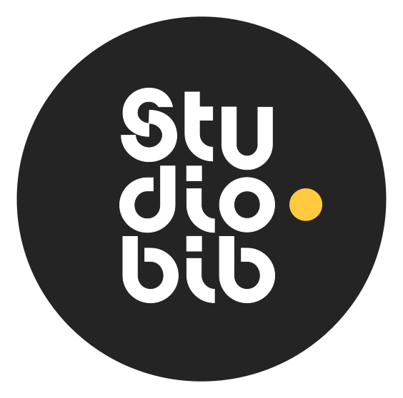

# **Technologies en bibliothèques**
### Les Bibliothèques de l’Université de Montréal  

Lien vers la présentation : studio.bib.umontreal.ca/formations/techno

---

Les Bibliothèques de l’Université de Montréal  
Direction de la recherche et des initiatives numériques (DRIN)  
Équipe expérience numérique  

---

# **Notre rôle**

- Concevoir et maintenir des espaces technologiques  
- Développer des outils internes innovants  
- Soutenir la communauté UdeM 
- Renforcer la présence numérique des bibliothèques  
- Créer des passerelles entre **technologie et pédagogie**

---

# **Atelier de fabrication**

---

<section 
  data-background-image="img/electronique.svg"
  data-background-size="500px"
  data-background-position="bottom 30px right 40px"
  data-background-repeat="no-repeat">

## [**Électronique & prototypage**](https://studio.bib.umontreal.ca/creatives/electronique)

- Arduino, Raspberry Pi
- Capteurs, moteurs, circuits  
- Projets étudiants (design, arts, sciences)  
- Support à la recherche expérimentale

</section>

---

<section 
  data-background-image="img/impression3d.svg"
  data-background-size="500px"
  data-background-position="bottom 30px right 40px"
  data-background-repeat="no-repeat">

# **Impression 3D**

- Parcs d’imprimantes Bambu Lab, Ultimaker, Prusa
- +18 imprimantes disponibles
- Impressions pour :
  - Design industriel  
  - Recherche biomédicale  
  - Arts visuels  
  - Projets pédagogiques
- Accompagnement complet : de l’idée à l'impression

</section>

---

# D'autres équipements
- [Découpe vinyle](https://studio.bib.umontreal.ca/creatives/decoupeuse)
- Scanner 3D
- [Brodeuse numérique et machine à coudre](https://studio.bib.umontreal.ca/creatives/art-textile)
- Station de soudure
- Stylet 3D

---

# Initiatives récentes
**Projet FilUM**

Recyclage de filaments 3D

- Revalorisation du plastique d’impression 3D  
- Transformation en **nouveaux filaments réutilisables**  
- Collaboration avec le **Lab Laventure**  
- Contribution à une écoconception durable  
- Sensibilisation des usagers à l’impact environnemental

---

# Initiatives récentes

Collaboration en cours avec le CHU Sainte-Justine afin de produire en impression 3D des modèles utilisés en ergothérapie pour la rééducation des jeunes patients. [En savoir plus](https://www.makersmakingchange.com/assistive-devices)

---

<section 
  data-background-image="img/vr.svg"
  data-background-size="500px"
  data-background-position="bottom 30px right 40px"
  data-background-repeat="no-repeat">

# [ **Réalité virtuelle**](https://studio.bib.umontreal.ca/creatives/vr)
## Un parc de 20 casques VR

- Casques Meta Quest 3 
- Applications pédagogiques :
  - Anatomie  
  - Simulation psychologique  
  - Architecture  
  - Art immersif  
  - Jeux!

> La VR devient un outil de médiation autant que d’apprentissage.

</section>

---

<section 
  data-background-image="img/edition.svg"
  data-background-size="500px"
  data-background-position="bottom 30px right 40px"
  data-background-repeat="no-repeat">

# [**Postes d'édition**](https://studio.bib.umontreal.ca/medias/postes-edition/)

### Logiciels spécialisés :
- Suite Adobe
- DaVinci Resolve
- Ableton Live
- Reaper

### Logiciels libres :
- Audacity
- OBS Studio

### Services
- Consultations personnalisées  
- Soutien aux projets

[Voir la liste des logiciels disponibles](https://studio.bib.umontreal.ca/informatique/logiciels)

</section>

---

<section 
  data-background-image="img/video.svg"
  data-background-size="500px"
  data-background-position="bottom 30px right 40px"
  data-background-repeat="no-repeat">

# **[Studio vidéo](https://studio.bib.umontreal.ca/espaces/studiovideo)**  
### (en révision majeure)

- Tournages pédagogiques  
- Captations institutionnelles  
- Éclairage studio  
- Caméras Full HD, micros, fond uni  
- Prochaines améliorations :
  - automatisation  
  - amélioration de la qualité
  - Prompteur
  - scénarios préconfigurés  
  - ergonomie  

</section>

---

<section 
  data-background-image="img/balado.svg"
  data-background-size="500px"
  data-background-position="bottom 30px right 40px"
  data-background-repeat="no-repeat">

# **[Studios balados](https://studio.bib.umontreal.ca/espaces/studiosbalado)**
## Un franc succès qui ne cesse de croître!

- [2 studios audio faciles à utiliser](https://studio.bib.umontreal.ca/espaces/studiosbaladoaudio)
- [Un studio balado **avec vidéo**](https://studio.bib.umontreal.ca/espaces/studiobaladovideo)
- Développé **à 100% en interne** :
  - Caméras *auto-switch*
  - Automatisation de l’enregistrement  
  - Prémontage automatique  
  - Interface simple → “appuyer et enregistrer”  

- Utilisations :
  - Enseignement  
  - Projets étudiants
  - Vulgarisation de la recherche  
  - Communication universitaire  

</section>

---

<section>

# [Laboratoire de visualisation](https://studio.bib.umontreal.ca/espaces/visualisation)
## Le mur vidéo

  <!-- Vidéo à gauche -->
  

    <iframe width="100%" height="315"
      src="https://www.youtube-nocookie.com/embed/bsAlfFIf3y4?si=X8ynVGaKvdC0oQqx"
      title="YouTube video player"
      frameborder="0"
      allowfullscreen>
    </iframe>
  

  <!-- Texte à droite -->
  

  - Affichage ultra haute résolution  
  - Visualisation de données  
  - Présentations interactives  
  - Expositions numériques  

  

</section>

---

# **Visibilité numérique**
## Avant : une fragmentation

- Services éclatés
- Informations difficiles à trouver  
- Peu de mise en valeur des espaces  
- Absence de marque cohérente

---

<section>

# studio·bib

  <!-- Texte à gauche -->
  

  Une identité claire pour l'offre technologique des bibliothèques à l’UdeM

  - Site Web dédié : **studio.bib.umontreal.ca**
  - Pages détaillées pour chaque espace  
  - Guides, formations, réservations  
  - Documentation  
  - Vision commune et centralisée  

  > L’objectif : rendre la créativité accessible, visible et inspirante.

  

  <!-- Image à droite -->
  

    
  

</section>

---

<section>

# Services à la communauté

  <!-- Colonne gauche -->
  

  ## Consultations

  - Accompagnement individuel  
  - Audio, vidéo, impression 3D, électronique  
  - Ouvert à toute la communauté UdeM  

  

  <!-- Colonne droite -->
  

  ## Ateliers & formations

  - Introduction à la baladodiffusion  
  - Impression 3D  
  - Modélisation 3D (bientôt!)  
  - Montage vidéo / audio  
  - Électronique / Arduino  
  - Ateliers intégrés au cursus (sur demande)  

  

</section>

---

# **Soutien à la recherche**

Ces espaces agissent comme infrastructure transversale pour la recherche à l’UdeM.

Nous accompagnons les équipes dans :
- La matérialisation d’idées (prototypage, impression 3D)
- La production et la diffusion scientifique (captation, montage, balado)
- La visualisation et l’exploration de données complexes

Impact : valorisation de la recherche + visibilité UdeM + mobilisation des connaissances + réduction des barrières d’entrée à l’expérimentation.

---

# **Vision stratégique**
## Pourquoi ces technologies en bibliothèque?

- Démocratiser l'accès aux outils professionnels  
- Soutenir la pédagogie active et expérientielle
- Renforcer l'autonomie et la littératie numérique  
- Offrir un terrain neutre pour expérimenter  
- Créer un écosystème d’innovation

---

# **Impacts**

- Amélioration de la littératie numérique  
- Nouvelle culture de création sur le campus  
- Plus grande collaboration entre les unités
- Succès institutionnel du studio balado vidéo  
- Contribution à la durabilité (Ex : FilUM)

---

# **Défis**

- Maintien d’expertise technique spécialisée et évolutive
- Formations continues nécessaires pour les équipes
- Charge de travail croissante liée à la popularité des espaces
- Uniformisation des expériences utilisateurs à travers les espaces
- Visibilité interne encore perfectible
- Arrimage institutionnel des technologies aux pratiques pédagogiques

---

# **10. Conclusion**

> **Les bibliothèques ne sont plus seulement des lieux de savoir.  
Elles sont devenues des lieux où l’on crée, explore, expérimente, diffuse.**

### Tout est gratuit.  
### Tout est ouvert.  
### Tout est pensé pour favoriser la créativité.

---

<section 
  data-background-image="img/question.svg"
  data-background-size="500px"
  data-background-position="bottom 30px right 40px"
  data-background-repeat="no-repeat">

# **Merci!**
### Questions?

**studio.bib.umontreal.ca**  

**studio@bib.umontreal.ca**

</section>

---

# Colophon

Présentation réalisée en Markdown avec Reveal.js (framework HTML libre)

Hébergement statique versionné avec Git

Icônes : The Noun Project

CC BY 4.0 - Les Bibliothèques de l’Université de Montréal, 2026